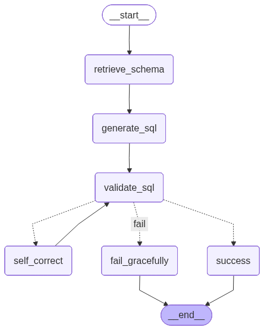

# Query Staff

Text2SQL MVP for the MySQL employees sample database.

## What It Does
- Takes a natural-language question in Streamlit.
- Generates SQL with a LangGraph-based planning workflow.
- Lets the user review/edit SQL before execution.
- Executes approved SQL with read-only safety checks.
- Renders query results as a table.

## Agent Graph
The generation workflow is implemented in LangGraph and exported as Mermaid PNG.



## Workflow
1. Retrieve schema context.
2. Generate SQL (structured output: `explanation`, `sql_query`).
3. Validate SQL against safety policy.
4. If validation fails, run self-correction (structured output again).
5. Repeat correction/validation up to 3 attempts.
6. On success, Streamlit shows editable SQL and user can run it.

## Tech Stack
- Python 3.13
- uv
- LangGraph + LangChain + Gemini
- Streamlit
- MySQL (`genschsa/mysql-employees`)
- Docker Compose

## Project Structure
```text
.
├── docker-compose.yml
├── Dockerfile
├── pyproject.toml
├── src/
│   ├── app.py
│   ├── agent.py
│   ├── database.py
│   └── prompts.py
└── docs/
    ├── agent-graph.mmd
    └── agent-graph.png
```

## Quick Start
1. Configure environment variables in `.env`.
2. Start the stack:
   ```bash
   docker compose up --build
   ```
3. Open Streamlit:
   - http://localhost:8501

## Notes
- SQL execution is **not** part of agent nodes.
- Execution happens in Streamlit only after user approval.
- Query safety requires:
  - `SELECT` only
  - single statement
  - no mutating/DDL keywords
  - `LIMIT` for non-aggregate queries
